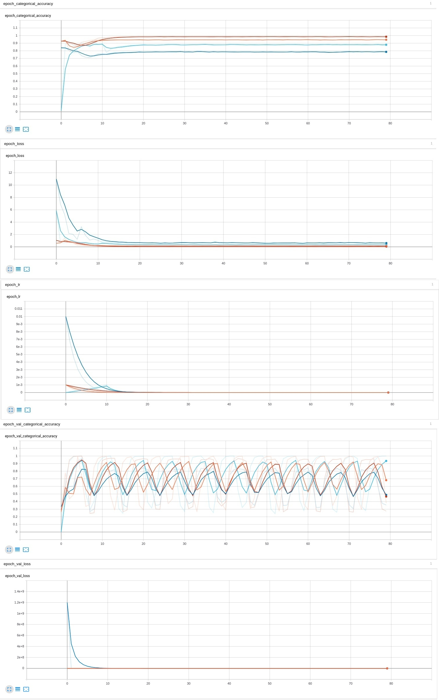

# Lab_5
## Step decay

### Оранжевый - init_lr 0.001, drop 0.4
### Синий - init_lr 0.001, drop 0.5
### Красный - init_lr 0.0001, drop 0.5
### Голубой - с Warm-Up на 10 эпох init_lr 0.001 до 0.01, drop 0.2
 На обучающей выборке на графике точности сошлись все варинты, однако же красный сошелся немного быстрее остальных. На графике ошибки варианты сошлись практически в одно время, оранжевый график показывает себя лучше остальных. На валидационной выборке на графике точности все графики практически повторяют друг дурга, а на графике ошибки только синий имеет значительный выброс, оранжевый и тут показывает себя лучше остальных. Из этого следует, что оптимальным и будет оранжевый график (init_lr 0.001, drop 0.4)

## Exponential Decay

### Оранжевый - init_lr 0.001, k 0.5
### Синий - init_lr 0.01, k 0.4
### Красный - init_lr 0.001, k 0.2
### Голубой - с Warm-Up на 10 эпох init_lr 0.001 до 0.01, k 0.4
 На обучающей выборке на графике точности красный график лучший результат, оранжевый крайне близок к нему, голубой и синий тоже неплохие значения точности, но они немного хуже. На графике ошибки, лучшие значения опять-таки показывают красный и оранжевый графики, синий и голубой имеют достаточно выскоие пики в начале. На графике точности валидационноый выборке, все графики имеют схожие по значению выборосы, но заметно что синий график имеет самый маленькие. На а на графике ошибки, только синий график имеет пик в начале. Из этого можно сделать вывод, что оптимальным является красный график (init_lr 0.001, k 0.2)

